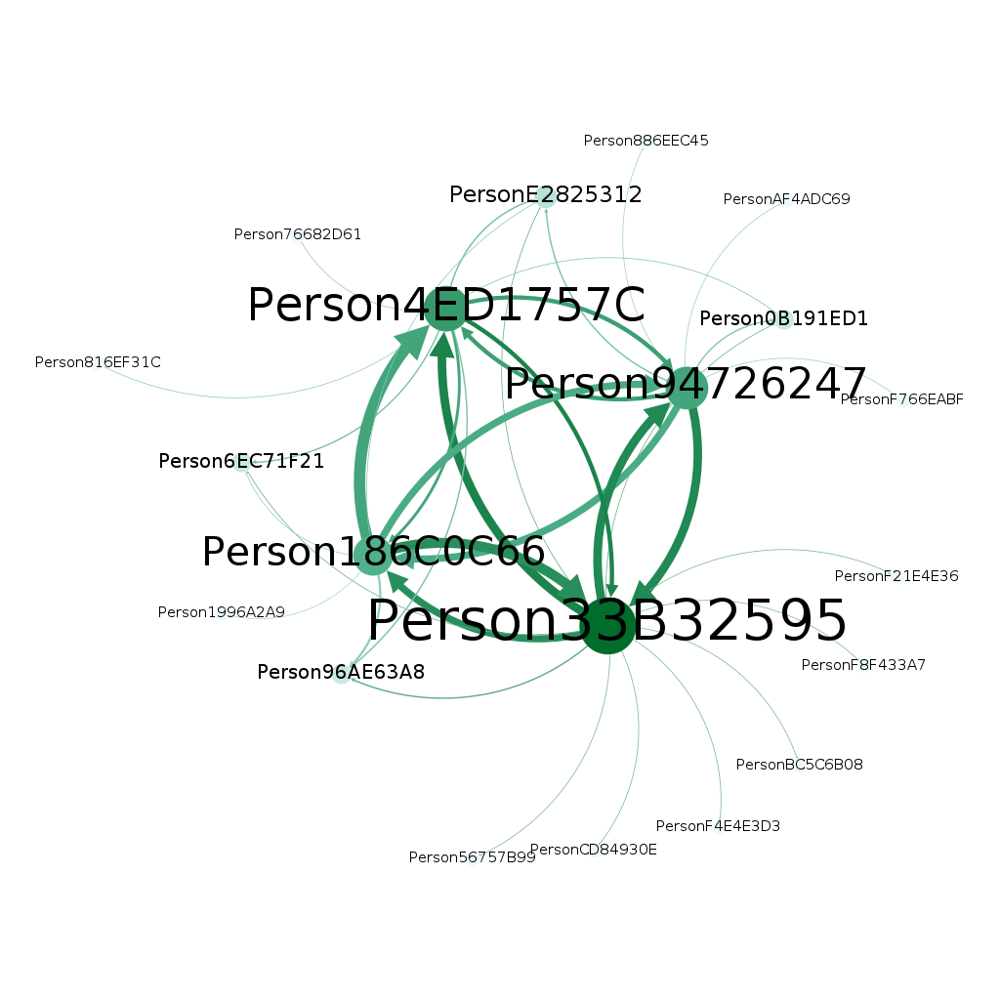

# CLAn - Call Log Analyzer

<div align="center">

</div>

<br/>

[^note-3]

This little `C#` puzzle was actually a coding challenge for a data forensics 🕵️‍♂️ role [^note-2]

## Summary of the Task

> **Goal:** 
>
> Develop a console application in **C# (.NET 8.0)** to analyze two CSV files [^note-1] containing billing data from phone calls. 
> 
> **Tasks:**
> 
>* Identify the different telephone numbers: per file and in total.
>
>* Identify the queried telephone numbers (target numbers).
>
>* Examine the contacts between the two target numbers (when and how often?).
>
>* Identify common contacts (telephone numbers that appear in both source files).

[^note-1]: Two files each containing a few hundred lines were provided.

[^note-2]: I used AI (specifically ChatGPT 4.0 in early 2024) to help draft parts of the Python test data generator `data/gendata.py`. Let's just say this approach raised some eyebrows among the interviewers—they asked if I'd managed *any* part of the task without AI! They also warned my script wouldn't handle a million lines of test data. Got me there! I think I forgot some indices and transaction techniques in the data model. I improved this with version 1.0.2.

[^note-3]: Nodes: `sqlite3 -header -csv log.db "SELECT Id, Name AS Label FROM Person;" > nodes.csv` Edges: `sqlite3 -header -csv log.db "SELECT SenderId AS Source, ReceiverId AS Target, COUNT(*) AS Weight FROM Log GROUP BY SenderId, ReceiverId;" > edges.csv`

## Implementation

A .NET 8.0 console application for analyzing telephone logs.

    ./CLAn/bin/Release/net8.0/publish/CLAn --help
    Description:
    CLAn - Call Log Analyzer

    Usage:
    CLAn [command] [options]

    Options:
    --version       Show version information
    -?, -h, --help  Show help and usage information

    Commands:
    import   Daten einlesen
    analyze  Analyse durchführen
    clean    Alle Daten löschen

## Install 

### SDK & Runtime

Check if available:

    dotnet --list-sdks

    dotnet --list-runtimes

[Download .NET 8.0 & Runtime](https://dotnet.microsoft.com/en-us/download/dotnet/8.0), if not yet installed.

### Load the Repository
    
    git clone https://github.com/masc2026/clan.git

## Build

### Restore (on a new machine):

    cd clan
    dotnet restore

### Build:

    cd clan
    dotnet clean
    dotnet publish

Check the Version

    ./CLAn/bin/Release/net8.0/publish/CLAn --version
>
    1.0.2.2

## About the Python Test Data Generator `gendata.py`

The [`gendata.py`](./data/gendata.py) script generates the CSV test data for the C# application. It simulates a realistic network of phone calls between "suspects."

#### Customize

**1. Volume & Output:**
* `FILES_TO_GENERATE`: Number of log files (suspects) to create. Default is `15`.
* `TARGET_ROWS`: The goal for the number of calls per file. *Note: The script stops early if the simulation reaches the end date.*
* `OUTPUT_DIR`: The folder where CSV files are saved.

**2. Timeframe:**
* `START_DATE` & `END_DATE`: The date range for the call logs.

**3. Behavior (The "Chatty" Factor):**
* `MIN_PAUSE_MINUTES` & `MAX_PAUSE_MINUTES`: The break time between calls. 
    * *Tip:* Lower numbers = "Chatty" person (more data). Higher numbers = relaxed person (less data).
* `SLEEP_START_HOUR` & `SLEEP_END_HOUR`: The hours when the person is sleeping (no calls generated).

**How to run:**

```bash
python3 data/gendata.py
```

## Run

There are three commands: `import`, `analyze`, `clean`. Get help with:

`./CLAn/bin/Release/net8.0/publish/CLAn <command> --help  `


### Performance Benchmark

Comparison between **Apple Mac Mini M1** (2020) and **Arch Linux PC** (2024).

| Step | Task / Command | Dataset size <br> *(Rows per File / Total)* | Runtime `macOS` <br> *(M1 16GB)* | Runtime `Linux` <br> *(Ryzen 7 9800X3D 64GB)* |
| :--- | :--- | :--- | :--- | :--- |
| **1.** | **Generate** (`gendata.py`) | 20k / 300k | 2.0s | 1.2s |
| **2.** | **Import** (`CLAn import`) | 20k / 300k | 116s (~2 min) | 108s (~1.8 min) |
| **3.** | **Analyze** (`CLAn analyze`) | 20k / 300k | 2.0s | 1.2s |
| | | | | |
| **1.** | **Generate** (`gendata.py`) | 50k / 750k | 5.0s | 3.0s |
| **2.** | **Import** (`CLAn import`) | 50k / 750k | 620s (~10 min) | 510s (~8.5 min) |
| **3.** | **Analyze** (`CLAn analyze`) | 50k / 750k | 3.0s | 2.1s |

### 1.) Test Data

Generate new Test data (the _call logs_) _or_ use log file data in (./data/) _or_ chose your own:

#### a) Generate new Test data

    python3 data/gendata.py

#### b) Use the log files included in the repository

> ⚠️ **Note:** All phone numbers in the dataset are randomly generated. Any resemblance to actual phone numbers is purely coincidental.

#### c) Choose your own files

See [Log file format](#log-file-format).

### 2.) Import Data

Example with 4 (according to the `FILES_TO_GENERATE` setting in [`gendata.py`](./data/gendata.py) ) call log files:

`Zsh` command:

    for i in {1..4}; do ./CLAn/bin/Release/net8.0/publish/CLAn import -f data/log$i.csv; done

### 3.) Analyze Data

Example (using the log files data in [./data/](./data/)):

    ./CLAn/bin/Release/net8.0/publish/CLAn analyze

    ############ F1: 
    Es gibt Abfragen zu:
        Person94726247 (+491518xxxxxxx) in Log-Datei: /home/user/Projekte/github/clan/data/log1.csv
        Person4ED1757C (+491512xxxxxxx) in Log-Datei: /home/user/Projekte/github/clan/data/log2.csv
        Person33B32595 (+491517xxxxxxx) in Log-Datei: /home/user/Projekte/github/clan/data/log3.csv
        Person186C0C66 (+49160xxxxxxx) in Log-Datei: /home/user/Projekte/github/clan/data/log4.csv
    ############ F2: 
    Statistik zu den Telefonnummern:
    Anzahl der unterschiedlichen Telefonnummern: 9 in Log-Datei: /home/user/Projekte/github/clan/data/log1.csv
    Anzahl der unterschiedlichen Telefonnummern: 10 in Log-Datei: /home/user/Projekte/github/clan/data/log2.csv
    Anzahl der unterschiedlichen Telefonnummern: 14 in Log-Datei: /home/user/Projekte/github/clan/data/log3.csv
    Anzahl der unterschiedlichen Telefonnummern: 8 in Log-Datei: /home/user/Projekte/github/clan/data/log4.csv
    Gesamtzahl der unterschiedlichen Telefonnummern über alle Log-Dateien: 20
    ############ F3: 
    Telefonate der abgefragten Telefonnummern untereinander:
    Es gab insgesamt 12 Telefonate zwischen Person33B32595 (+491517xxxxxxx) und Person94726247 (+491518xxxxxxx).
    Es gab 6 Anrufe von Person94726247 (+491518xxxxxxx) an Person33B32595 (+491517xxxxxxx):
        Datum: 10.01.2018 16:24:26 Dauer: 5820 [s]
        Datum: 11.08.2021 22:57:57 Dauer: 6840 [s]
        Datum: 25.03.2023 20:13:06 Dauer: 25320 [s]
        Datum: 11.07.2023 15:27:45 Dauer: 15480 [s]
        Datum: 06.05.2024 08:53:12 Dauer: 28920 [s]
        Datum: 26.07.2025 14:04:42 Dauer: 29460 [s]
    Es gab 6 Anrufe von Person33B32595 (+491517xxxxxxx) an Person94726247 (+491518xxxxxxx) :
        Datum: 07.09.2018 09:16:21 Dauer: 4560 [s]
        Datum: 28.03.2019 21:47:31 Dauer: 13080 [s]
        Datum: 07.07.2019 20:11:02 Dauer: 28800 [s]
        Datum: 20.08.2021 20:57:58 Dauer: 21840 [s]
        Datum: 15.08.2022 21:19:51 Dauer: 12720 [s]
        Datum: 05.08.2024 19:07:42 Dauer: 32400 [s]
    Es gab insgesamt 6 Telefonate zwischen Person4ED1757C (+491512xxxxxxx) und Person94726247 (+491518xxxxxxx).
    Es gab 3 Anrufe von Person94726247 (+491518xxxxxxx) an Person4ED1757C (+491512xxxxxxx):
        Datum: 23.02.2019 16:14:30 Dauer: 26880 [s]
        Datum: 27.01.2021 21:55:45 Dauer: 1800 [s]
        Datum: 14.05.2021 12:48:33 Dauer: 34980 [s]
    Es gab 3 Anrufe von Person4ED1757C (+491512xxxxxxx) an Person94726247 (+491518xxxxxxx) :
        Datum: 20.12.2019 19:19:36 Dauer: 19860 [s]
        Datum: 20.03.2020 10:19:10 Dauer: 11880 [s]
        Datum: 26.03.2024 22:31:32 Dauer: 19500 [s]
    Es gab insgesamt 10 Telefonate zwischen Person186C0C66 (+49160xxxxxxx) und Person94726247 (+491518xxxxxxx).
    Es gab 5 Anrufe von Person94726247 (+491518xxxxxxx) an Person186C0C66 (+49160xxxxxxx):
        Datum: 05.04.2019 10:10:48 Dauer: 5220 [s]
        Datum: 04.04.2020 10:03:39 Dauer: 1920 [s]
        Datum: 18.12.2021 17:42:11 Dauer: 35340 [s]
        Datum: 20.05.2022 14:51:03 Dauer: 20220 [s]
        Datum: 21.12.2022 20:43:51 Dauer: 9960 [s]
    Es gab 5 Anrufe von Person186C0C66 (+49160xxxxxxx) an Person94726247 (+491518xxxxxxx) :
        Datum: 05.05.2020 10:20:40 Dauer: 15360 [s]
        Datum: 28.02.2021 16:54:57 Dauer: 600 [s]
        Datum: 11.06.2022 14:41:38 Dauer: 3360 [s]
        Datum: 13.02.2023 11:12:46 Dauer: 17220 [s]
        Datum: 16.03.2024 18:36:19 Dauer: 23100 [s]
    Es gab insgesamt 9 Telefonate zwischen Person4ED1757C (+491512xxxxxxx) und Person33B32595 (+491517xxxxxxx).
    Es gab 6 Anrufe von Person33B32595 (+491517xxxxxxx) an Person4ED1757C (+491512xxxxxxx):
        Datum: 27.03.2021 18:45:56 Dauer: 34020 [s]
        Datum: 04.06.2022 08:10:28 Dauer: 13980 [s]
        Datum: 02.07.2023 07:02:05 Dauer: 3000 [s]
        Datum: 12.05.2024 09:38:48 Dauer: 25560 [s]
        Datum: 07.03.2025 21:27:17 Dauer: 28860 [s]
        Datum: 21.11.2025 17:42:54 Dauer: 24900 [s]
    Es gab 3 Anrufe von Person4ED1757C (+491512xxxxxxx) an Person33B32595 (+491517xxxxxxx) :
        Datum: 01.09.2020 12:16:36 Dauer: 22080 [s]
        Datum: 03.11.2021 19:04:45 Dauer: 33420 [s]
        Datum: 25.12.2024 18:46:12 Dauer: 27480 [s]
    Es gab insgesamt 12 Telefonate zwischen Person186C0C66 (+49160xxxxxxx) und Person33B32595 (+491517xxxxxxx).
    Es gab 5 Anrufe von Person33B32595 (+491517xxxxxxx) an Person186C0C66 (+49160xxxxxxx):
        Datum: 17.02.2020 09:16:02 Dauer: 25860 [s]
        Datum: 19.04.2023 13:08:38 Dauer: 7560 [s]
        Datum: 11.06.2023 14:19:28 Dauer: 12900 [s]
        Datum: 09.08.2024 07:32:01 Dauer: 24540 [s]
        Datum: 20.11.2025 22:52:46 Dauer: 35940 [s]
    Es gab 7 Anrufe von Person186C0C66 (+49160xxxxxxx) an Person33B32595 (+491517xxxxxxx) :
        Datum: 16.11.2018 19:08:47 Dauer: 28200 [s]
        Datum: 20.02.2019 09:25:36 Dauer: 23940 [s]
        Datum: 30.12.2021 12:19:23 Dauer: 21360 [s]
        Datum: 12.02.2022 20:59:15 Dauer: 5040 [s]
        Datum: 27.12.2022 20:54:32 Dauer: 20820 [s]
        Datum: 04.02.2025 14:13:13 Dauer: 4140 [s]
        Datum: 23.03.2025 08:32:34 Dauer: 12240 [s]
    Es gab insgesamt 10 Telefonate zwischen Person186C0C66 (+49160xxxxxxx) und Person4ED1757C (+491512xxxxxxx).
    Es gab 2 Anrufe von Person4ED1757C (+491512xxxxxxx) an Person186C0C66 (+49160xxxxxxx):
        Datum: 01.08.2018 19:51:00 Dauer: 8640 [s]
        Datum: 27.05.2023 18:55:13 Dauer: 12900 [s]
    Es gab 8 Anrufe von Person186C0C66 (+49160xxxxxxx) an Person4ED1757C (+491512xxxxxxx) :
        Datum: 21.07.2018 12:03:37 Dauer: 17520 [s]
        Datum: 10.01.2020 21:39:13 Dauer: 11040 [s]
        Datum: 18.05.2020 19:41:14 Dauer: 15960 [s]
        Datum: 31.01.2021 08:12:41 Dauer: 16260 [s]
        Datum: 14.10.2022 20:07:34 Dauer: 1440 [s]
        Datum: 07.11.2022 16:58:57 Dauer: 34440 [s]
        Datum: 06.11.2023 11:14:25 Dauer: 19320 [s]
        Datum: 06.11.2025 15:39:38 Dauer: 27900 [s]
    ############ F4: 
    Vorkommen von Telefonnummern in den Log-Files:
    Person94726247 (+491518xxxxxxx) kommmt vor in:
        Log-Datei: /home/user/Projekte/github/clan/data/log1.csv
        Log-Datei: /home/user/Projekte/github/clan/data/log2.csv
        Log-Datei: /home/user/Projekte/github/clan/data/log3.csv
        Log-Datei: /home/user/Projekte/github/clan/data/log4.csv
    Person33B32595 (+491517xxxxxxx) kommmt vor in:
        Log-Datei: /home/user/Projekte/github/clan/data/log1.csv
        Log-Datei: /home/user/Projekte/github/clan/data/log2.csv
        Log-Datei: /home/user/Projekte/github/clan/data/log3.csv
        Log-Datei: /home/user/Projekte/github/clan/data/log4.csv
    Person4ED1757C (+491512xxxxxxx) kommmt vor in:
        Log-Datei: /home/user/Projekte/github/clan/data/log1.csv
        Log-Datei: /home/user/Projekte/github/clan/data/log2.csv
        Log-Datei: /home/user/Projekte/github/clan/data/log3.csv
        Log-Datei: /home/user/Projekte/github/clan/data/log4.csv
    Person186C0C66 (+49160xxxxxxx) kommmt vor in:
        Log-Datei: /home/user/Projekte/github/clan/data/log1.csv
        Log-Datei: /home/user/Projekte/github/clan/data/log2.csv
        Log-Datei: /home/user/Projekte/github/clan/data/log3.csv
        Log-Datei: /home/user/Projekte/github/clan/data/log4.csv
    Person886EEC45 (+49162xxxxxxx) kommmt vor in:
        Log-Datei: /home/user/Projekte/github/clan/data/log1.csv
    Person0B191ED1 (+491623xxxxxxx) kommmt vor in:
        Log-Datei: /home/user/Projekte/github/clan/data/log1.csv
        Log-Datei: /home/user/Projekte/github/clan/data/log2.csv
        Log-Datei: /home/user/Projekte/github/clan/data/log3.csv
    PersonF766EABF (+491720xxxxxxx) kommmt vor in:
        Log-Datei: /home/user/Projekte/github/clan/data/log1.csv
    PersonE2825312 (+491513xxxxxxx) kommmt vor in:
        Log-Datei: /home/user/Projekte/github/clan/data/log1.csv
        Log-Datei: /home/user/Projekte/github/clan/data/log2.csv
        Log-Datei: /home/user/Projekte/github/clan/data/log3.csv
        Log-Datei: /home/user/Projekte/github/clan/data/log4.csv
    PersonAF4ADC69 (+491570xxxxxxx) kommmt vor in:
        Log-Datei: /home/user/Projekte/github/clan/data/log1.csv
    Person96AE63A8 (+49177xxxxxxx) kommmt vor in:
        Log-Datei: /home/user/Projekte/github/clan/data/log2.csv
        Log-Datei: /home/user/Projekte/github/clan/data/log3.csv
        Log-Datei: /home/user/Projekte/github/clan/data/log4.csv
    Person6EC71F21 (+491729xxxxxxx) kommmt vor in:
        Log-Datei: /home/user/Projekte/github/clan/data/log2.csv
        Log-Datei: /home/user/Projekte/github/clan/data/log3.csv
        Log-Datei: /home/user/Projekte/github/clan/data/log4.csv
    Person816EF31C (+49151xxxxxxx) kommmt vor in:
        Log-Datei: /home/user/Projekte/github/clan/data/log2.csv
    Person76682D61 (+491627xxxxxxx) kommmt vor in:
        Log-Datei: /home/user/Projekte/github/clan/data/log2.csv
    PersonF21E4E36 (+491622xxxxxxx) kommmt vor in:
        Log-Datei: /home/user/Projekte/github/clan/data/log3.csv
    PersonF8F433A7 (+49151xxxxxxx) kommmt vor in:
        Log-Datei: /home/user/Projekte/github/clan/data/log3.csv
    PersonBC5C6B08 (+49172xxxxxxx) kommmt vor in:
        Log-Datei: /home/user/Projekte/github/clan/data/log3.csv
    Person56757B99 (+491774xxxxxxx) kommmt vor in:
        Log-Datei: /home/user/Projekte/github/clan/data/log3.csv
    PersonF4E4E3D3 (+491725xxxxxxx) kommmt vor in:
        Log-Datei: /home/user/Projekte/github/clan/data/log3.csv
    PersonCD84930E (+49177xxxxxxx) kommmt vor in:
        Log-Datei: /home/user/Projekte/github/clan/data/log3.csv
    Person1996A2A9 (+491620xxxxxxx) kommmt vor in:
        Log-Datei: /home/user/Projekte/github/clan/data/log4.csv
    ############ F5: 
    Gemeinsame Telefonkontakte:
    Die Abgefragten Person94726247, Person33B32595 hatten jeweils Anrufe mit:
        Person4ED1757C (+491512xxxxxxx)
        Person186C0C66 (+49160xxxxxxx)
        Person0B191ED1 (+491623xxxxxxx)
        PersonE2825312 (+491513xxxxxxx)
    Die Abgefragten Person94726247, Person4ED1757C hatten jeweils Anrufe mit:
        Person33B32595 (+491517xxxxxxx)
        Person186C0C66 (+49160xxxxxxx)
        Person0B191ED1 (+491623xxxxxxx)
        PersonE2825312 (+491513xxxxxxx)
    Die Abgefragten Person94726247, Person186C0C66 hatten jeweils Anrufe mit:
        Person33B32595 (+491517xxxxxxx)
        Person4ED1757C (+491512xxxxxxx)
        PersonE2825312 (+491513xxxxxxx)
    Die Abgefragten Person33B32595, Person4ED1757C hatten jeweils Anrufe mit:
        Person94726247 (+491518xxxxxxx)
        Person186C0C66 (+49160xxxxxxx)
        Person0B191ED1 (+491623xxxxxxx)
        PersonE2825312 (+491513xxxxxxx)
        Person96AE63A8 (+49177xxxxxxx)
        Person6EC71F21 (+491729xxxxxxx)
    Die Abgefragten Person33B32595, Person186C0C66 hatten jeweils Anrufe mit:
        Person94726247 (+491518xxxxxxx)
        Person4ED1757C (+491512xxxxxxx)
        PersonE2825312 (+491513xxxxxxx)
        Person96AE63A8 (+49177xxxxxxx)
        Person6EC71F21 (+491729xxxxxxx)
    Die Abgefragten Person4ED1757C, Person186C0C66 hatten jeweils Anrufe mit:
        Person94726247 (+491518xxxxxxx)
        Person33B32595 (+491517xxxxxxx)
        PersonE2825312 (+491513xxxxxxx)
        Person96AE63A8 (+49177xxxxxxx)
        Person6EC71F21 (+491729xxxxxxx)


### Clean Data

This causes the database file (see [config.json](./CLAn/config.json)) to be deleted:

    ./CLAn/bin/Release/net8.0/publish/CLAn clean

## Customize

Customize the SQLite database name, the separator and the log data format in [config.json](./CLAn/config.json).

### Log file format

Default format settings given in [config.json](./CLAn/config.json):

    Datum;Zeit;Anrufer;Angerufener;Typ;Richtung;Dauer
    Mi. 06.04.2022;21:01:42;+491331234566;01511222222;SPRACHE;S;01:25
    Do. 07.04.2022;21:39:26;01511111111;001331234566;SPRACHE;E;00:43
    Fr. 08.04.2022;12:03:44;01331234566;01511111111;SPRACHE;S;01:37
    Sa. 09.04.2022;15:14:19;01511222222;+491331234566;SPRACHE;E;00:41
    So. 10.04.2022;04:40:40;001511234444;001331234566;SPRACHE;E;01:33
    ...